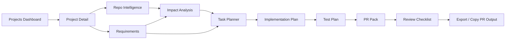
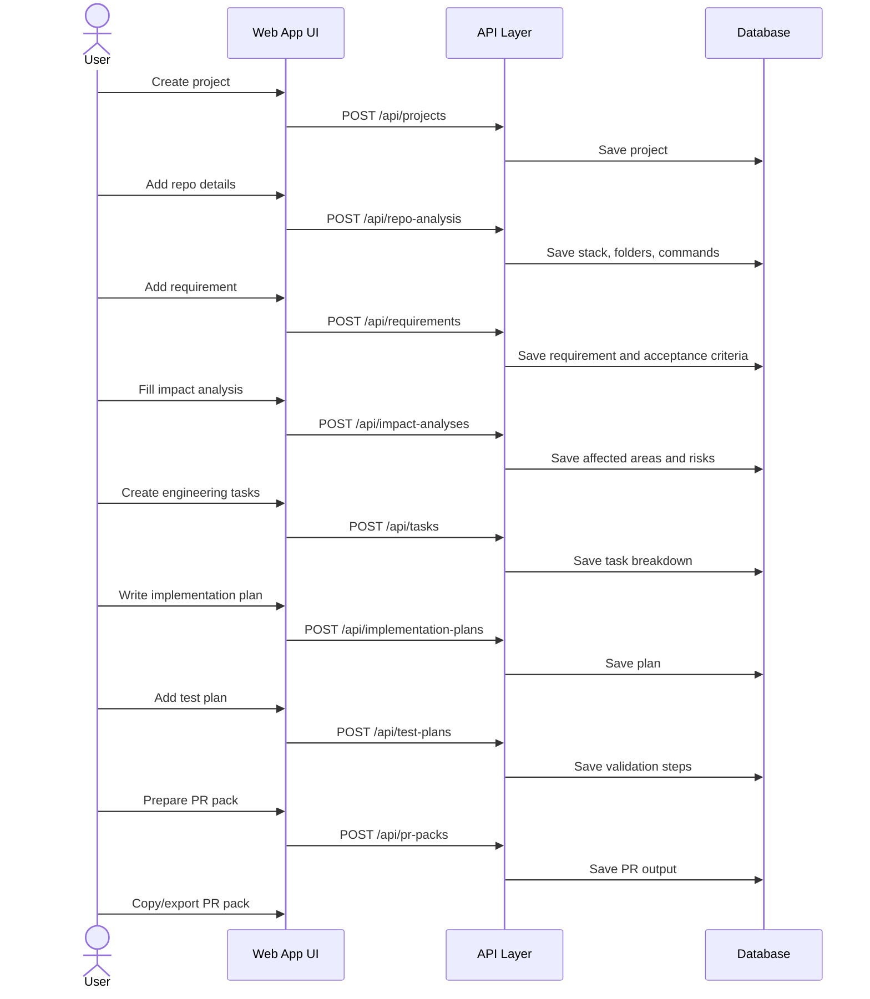

# App Implementation Blueprint

This document explains how the developer workflow will be implemented inside the software app.

It maps the workflow stages into:

- product screens
- backend modules
- database tables
- API routes
- build phases for the team

## Important Scope Note

The existing project spec in `specs/2026-06-12-idea-to-spec-design.md` describes the first wedge as:

> Idea -> Spec/PRD

The newer product direction in `docs/Project Description.md` describes a larger workflow:

> Requirement -> Impact Analysis -> Task Plan -> Implementation Plan -> PR Pack

For a 2-month team project, the practical version should be:

> A structured workflow app that helps developers create review-ready engineering artifacts.

This means the app should not try to automatically modify code or deeply integrate with GitHub in the MVP. Instead, it should guide the user through each stage and store the outputs.

## Product Flow Inside The App



## App Navigation

The app can be built with these main pages:

| Page | Purpose |
| --- | --- |
| Projects | List projects and create a new project |
| Project Detail | Show project summary, progress, and next actions |
| Repo Intelligence | Capture repo structure, stack, commands, and important folders |
| Requirements | Add and manage requirements |
| Requirement Detail | View one requirement and its workflow progress |
| Impact Analysis | Capture affected modules, risks, and test scope |
| Task Planner | Break a requirement into engineering tasks |
| Implementation Plan | Plan one selected task before coding |
| Test Plan | Define automated/manual validation steps |
| PR Pack | Generate editable PR title, description, checklist, release notes, and rollback plan |

## User Journey



## Core Data Model

Minimum MVP tables:

```text
projects
  id
  name
  description
  repo_url
  status
  created_at
  updated_at

repo_analysis
  id
  project_id
  framework
  package_manager
  build_command
  test_command
  important_folders
  architecture_notes
  created_at
  updated_at

requirements
  id
  project_id
  title
  description
  business_objective
  assumptions
  open_questions
  status
  created_at
  updated_at

requirement_acceptance_criteria
  id
  requirement_id
  description
  is_required
  created_at

impact_analyses
  id
  requirement_id
  affected_modules
  affected_files
  frontend_impact
  backend_impact
  database_impact
  api_impact
  dependency_impact
  security_impact
  risk_level
  test_scope
  created_at
  updated_at

engineering_tasks
  id
  requirement_id
  title
  description
  task_type
  priority
  risk_level
  owner
  status
  created_at
  updated_at

implementation_plans
  id
  task_id
  summary
  steps
  affected_files
  design_choices
  risks
  validation_steps
  rollback_notes
  created_at
  updated_at

test_plans
  id
  task_id
  automated_tests
  manual_checks
  regression_checks
  test_evidence
  created_at
  updated_at

pr_packs
  id
  task_id
  branch_name
  commit_message
  pr_title
  pr_description
  checklist
  release_notes
  rollback_plan
  created_at
  updated_at

audit_logs
  id
  entity_type
  entity_id
  action
  actor_name
  created_at
```

## Backend Modules

The backend should be organized by workflow domain:

```text
server/
  projects/
  repo-analysis/
  requirements/
  impact-analysis/
  engineering-tasks/
  implementation-plans/
  test-plans/
  pr-packs/
  audit-logs/
```

Each module should normally contain:

```text
routes or handlers
validation schema
service logic
database queries
tests
```

## API Routes

Minimum API routes:

| Route | Purpose |
| --- | --- |
| `GET /api/projects` | List projects |
| `POST /api/projects` | Create project |
| `GET /api/projects/:id` | Get project detail |
| `PATCH /api/projects/:id` | Update project |
| `POST /api/projects/:id/repo-analysis` | Save repo intelligence |
| `POST /api/projects/:id/requirements` | Create requirement |
| `GET /api/requirements/:id` | Get requirement detail |
| `PATCH /api/requirements/:id` | Update requirement |
| `POST /api/requirements/:id/impact-analysis` | Save impact analysis |
| `POST /api/requirements/:id/tasks` | Create engineering task |
| `PATCH /api/tasks/:id` | Update task status/details |
| `POST /api/tasks/:id/implementation-plan` | Save implementation plan |
| `POST /api/tasks/:id/test-plan` | Save test plan |
| `POST /api/tasks/:id/pr-pack` | Save PR pack |

## Frontend Component Structure

Example structure for a React or Next.js app:

```text
src/
  app/
    projects/
    projects/[projectId]/
    requirements/[requirementId]/
    tasks/[taskId]/
  components/
    layout/
    projects/
    repo-analysis/
    requirements/
    impact-analysis/
    task-planner/
    implementation-plan/
    test-plan/
    pr-pack/
    shared/
  lib/
    api-client.ts
    validation/
    formatters/
  types/
```

## Screen-Level Implementation

### 1. Projects Dashboard

User can:

- create a project
- view all projects
- see repo connection/status
- see number of active requirements and tasks

This screen uses:

- `projects`
- `requirements`
- `engineering_tasks`

### 2. Project Detail

User can see:

- project summary
- repo intelligence status
- requirements list
- task progress
- latest PR packs

This becomes the main workspace for one project.

### 3. Repo Intelligence

MVP implementation should be manual entry, not automatic scanning.

User enters:

- framework
- package manager
- build command
- test command
- important folders
- architecture notes

Later enhancement:

- upload repo zip
- connect GitHub
- auto-detect structure

### 4. Requirements

User enters:

- title
- description
- business objective
- acceptance criteria
- assumptions
- open questions

MVP can use forms and editable text areas.

Later enhancement:

- AI-assisted parsing from pasted requirement text

### 5. Impact Analysis

User fills:

- affected frontend areas
- affected backend areas
- affected APIs
- affected database tables
- dependency impact
- security impact
- test scope
- risk level

MVP should use structured fields, checkboxes, and dropdowns.

### 6. Task Planner

User creates engineering tasks from the requirement.

Task fields:

- title
- description
- type
- owner
- priority
- risk
- status

Useful task types:

- frontend
- backend
- database
- API
- test
- docs
- DevOps

### 7. Implementation Plan

For each task, user fills:

- implementation steps
- affected files
- design choices
- risks
- validation steps
- rollback notes

This is the most important planning screen before coding.

### 8. Test Plan

User fills:

- automated tests to add/update
- manual QA steps
- regression checks
- test evidence

The app should make test planning visible before the PR pack is considered ready.

### 9. PR Pack

The app prepares:

- branch name
- commit message
- PR title
- PR description
- checklist
- release notes
- rollback plan

MVP implementation can generate this from stored task, requirement, impact, implementation, and test-plan data using templates.

Example:

```text
Branch:
feature/add-pr-pack-preview

Commit:
feat: add PR pack preview workflow

PR Title:
Add PR pack preview workflow

PR Description:
## Summary
- Adds PR pack creation for engineering tasks.
- Includes editable PR title, description, checklist, release notes, and rollback plan.

## Test Evidence
- Manual PR pack creation tested.
- Saved PR pack reload tested.

## Rollback
- Remove PR pack route and related database records if needed.
```

## Template-Based Generation

Because the team has limited time and wants minimal AI-generated code, PR pack generation should start with deterministic templates.

Example rule:

```text
PR title = task title
Branch name = task type + slugified task title
PR summary = requirement objective + task summary
Checklist = standard checklist + task-specific test scope
Rollback = implementation plan rollback notes
```

This is easier to build, test, and explain than AI-generated text.

## MVP Build Phases

### Phase 1: Foundation

Build:

- app scaffold
- database schema
- project CRUD
- basic layout/navigation

Outcome:

- users can create and view projects

### Phase 2: Requirement Workflow

Build:

- repo intelligence form
- requirements CRUD
- acceptance criteria
- project detail page

Outcome:

- users can capture project context and requirements

### Phase 3: Planning Workflow

Build:

- impact analysis
- task planner
- implementation plan

Outcome:

- users can turn requirements into planned engineering work

### Phase 4: Delivery Workflow

Build:

- test plan
- PR pack
- export/copy output
- audit log

Outcome:

- users can create review-ready PR artifacts

### Phase 5: Polish And Verification

Build:

- validation states
- empty states
- status indicators
- manual QA
- seed/demo data
- README updates

Outcome:

- app is demo-ready

## What The App Should Automate In MVP

Automate:

- status progress
- required-field validation
- branch-name formatting
- PR description templating
- checklist generation
- simple dashboard counts

Do not automate yet:

- code generation
- repo mutation
- automatic GitHub PR creation
- automatic test generation
- deployment automation
- complex security scanning

## Definition Of Done For MVP

The MVP is done when a user can complete this full path:

1. Create a project.
2. Add repo intelligence.
3. Create a requirement.
4. Add acceptance criteria.
5. Complete impact analysis.
6. Create engineering tasks.
7. Write an implementation plan for a task.
8. Add test plan.
9. Generate or edit PR pack.
10. Copy/export the PR pack for use in GitHub/GitLab.

## Recommended Team Split

For 4 people:

| Person | Primary Area |
| --- | --- |
| Developer 1 | Database schema, backend routes, API integration |
| Developer 2 | Projects, repo intelligence, requirements UI |
| Developer 3 | Impact analysis, task planner, implementation plan UI |
| Developer 4 | Test plan, PR pack, export/copy, QA/docs |

Rotate review responsibilities so every major change has another person checking it.

