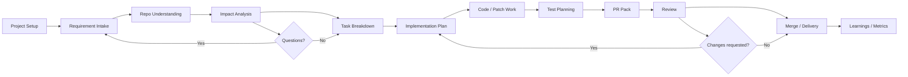
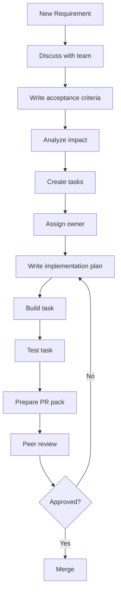

# Developer Workflow Architecture

This document explains the basic developer workflow our project should support. It is written for team members who are new to engineering delivery workflows.

The main idea is simple:

> Do not jump from requirement directly to code. First understand the requirement, check impact, break work into tasks, plan implementation, prepare code/test changes, and then create a review-ready PR package.

## High-Level Flow

## Stage 1: Project Setup

Purpose: Capture the basic project and repository information.

What happens:

- Create a project/workspace.
- Add repository name and link.
- Record framework, package manager, test command, build command, and important folders.
- Store who is working on the project.

Output:

- Project record
- Repository record
- Basic repo summary

Example:

- Project: Developer Delivery Console
- Repo: GitHub repo URL
- Frontend: React
- Backend: Node/Express
- Database: PostgreSQL
- Test command: `npm test`

## Stage 2: Requirement Intake

Purpose: Convert a rough idea, bug report, or feature request into something developers can work with.

What happens:

- Add the requirement text.
- Identify the business goal.
- Write acceptance criteria.
- List assumptions.
- List open questions.

Output:

- Requirement summary
- Acceptance criteria
- Open questions

Example:

Requirement:

> As a developer, I want to generate a PR description from an implementation plan so that I can create consistent pull requests.

Acceptance criteria:

- User can select a task.
- System creates a PR title.
- System creates a PR description.
- System creates a checklist.
- User can edit the generated PR pack before using it.

## Stage 3: Repo Understanding

Purpose: Understand the existing codebase before planning changes.

What happens:

- Identify app structure.
- Identify frontend, backend, database, APIs, and tests.
- Record important folders and commands.
- Note conventions used in the repo.

Output:

- Repo intelligence summary
- Key folders
- Build/test commands
- Known conventions

Example:

- `src/components`: reusable UI components
- `src/pages`: page-level routes
- `server/routes`: backend API routes
- `prisma/migrations`: database migrations

## Stage 4: Impact Analysis

Purpose: Understand what parts of the system may change and what risks exist.

What happens:

- Identify affected files, modules, screens, APIs, or database tables.
- Identify security, dependency, migration, and testing risks.
- Decide whether the requirement is small, medium, or high risk.
- Capture unresolved questions before implementation starts.

Output:

- Affected areas
- Risk level
- Test scope
- Open questions

Example:

Affected areas:

- Requirements page
- PR Pack page
- `pr_packs` table
- Backend endpoint for creating PR packs

Risks:

- Generated PR text may miss important test evidence.
- PR pack should be editable before use.

## Stage 5: Task Breakdown

Purpose: Split the requirement into clear engineering tasks.

What happens:

- Create small tasks developers can assign and track.
- Group tasks by type: frontend, backend, database, tests, docs, rollout.
- Add priority, owner, status, and risk.

Output:

- Engineering task list

Example tasks:

- Backend: Create `pr_packs` API endpoint.
- Database: Add `pr_packs` table.
- Frontend: Build PR Pack form and preview screen.
- Tests: Add API test for PR pack creation.
- Docs: Add PR pack workflow notes.

## Stage 6: Implementation Plan

Purpose: Decide how a task will be built before code changes begin.

What happens:

- Select one task.
- Write implementation steps.
- List files likely to change.
- Record design choices.
- Define validation steps.
- Add rollback notes.

Output:

- Implementation plan

Example:

Task:

- Build PR Pack preview screen.

Plan:

- Add PR Pack page route.
- Fetch selected task details.
- Render branch name, commit message, PR title, description, checklist, and release notes.
- Allow user to edit generated fields.
- Save final PR pack.

Validation:

- User can open PR Pack page.
- User can edit all fields.
- User can save PR pack.

## Stage 7: Code / Patch Work

Purpose: Make the actual code changes in a controlled way.

What happens:

- Developer works on the selected task.
- Changes are kept small and tied to the implementation plan.
- If the scope changes, update the task or plan.
- Do not mix unrelated changes in the same task.

Output:

- Code changes
- Patch or commit-ready work

Rule:

> Every code change should connect back to a requirement, task, and implementation plan.

## Stage 8: Test Planning

Purpose: Confirm how the change will be verified.

What happens:

- Add or update tests.
- Define manual test steps if automated tests are not available.
- Include regression checks for existing behavior.
- Every bug fix should include a test case or a clear manual reproduction check.

Output:

- Test suggestions
- Manual test checklist
- Test evidence for PR

Example:

- Run `npm test`.
- Create a PR pack from a task.
- Edit PR description.
- Save PR pack.
- Reload page and confirm saved data appears.

## Stage 9: PR Pack

Purpose: Prepare everything needed for a clean pull request.

What happens:

- Generate or write branch name.
- Generate or write commit message.
- Generate PR title.
- Generate PR description.
- Add checklist.
- Add test evidence.
- Add release notes.
- Add rollback plan.

Output:

- Review-ready PR package

Example:

Branch:

- `feature/pr-pack-preview`

Commit message:

- `feat: add PR pack preview workflow`

PR checklist:

- Requirement linked
- Impact reviewed
- Tests added or documented
- Manual QA completed
- Rollback plan included

## Stage 10: Review

Purpose: Let another person verify the change before merge.

What happens:

- Reviewer checks requirement alignment.
- Reviewer checks code quality.
- Reviewer checks tests.
- Reviewer checks risks and rollback notes.
- Developer updates work if changes are requested.

Output:

- Approved PR
- Requested changes
- Review comments

Review questions:

- Does this satisfy the acceptance criteria?
- Are affected areas correctly handled?
- Are tests enough for the risk?
- Is the PR description clear?
- Is rollback possible?

## Stage 11: Merge / Delivery

Purpose: Merge approved work and prepare it for release.

What happens:

- Merge PR after approval.
- Record release notes.
- Track whether deployment succeeded.
- Record any issues or follow-up work.

Output:

- Merged feature/fix
- Release notes
- Follow-up tasks if needed

## Stage 12: Learnings / Metrics

Purpose: Improve team delivery over time.

What happens:

- Track how long work takes.
- Track failed or reworked changes.
- Track common risk areas.
- Use learnings to improve planning and review.

Output:

- Delivery metrics
- Retrospective notes
- Process improvements

Simple metrics:

- Lead time: time from requirement to merge
- Rework: how often PRs need major changes
- Failure rate: how often changes cause issues
- Recovery time: how long it takes to fix failed changes

## Basic Team Workflow

## Roles

For a 4-person team, roles can rotate.

| Role | Responsibility |
| --- | --- |
| Requirement owner | Clarifies requirement, acceptance criteria, and open questions |
| Implementer | Writes the implementation plan and builds the task |
| Reviewer | Checks code, tests, risks, and PR quality |
| QA/documentation owner | Verifies behavior and updates docs/checklists |

One person can hold more than one role for small tasks, but every task should still have a reviewer.

## Simple Status Model

Use these statuses to keep the workflow easy to understand:

| Status | Meaning |
| --- | --- |
| Draft | Requirement or task is not ready yet |
| Ready | Work is clear enough to start |
| In Progress | Someone is actively working on it |
| Blocked | Work cannot continue without an answer or dependency |
| In Review | Work is ready for another person to review |
| Changes Requested | Reviewer asked for updates |
| Done | Work is approved and merged/completed |

## Minimum Data To Capture

For each requirement:

- Title
- Description
- Business objective
- Acceptance criteria
- Open questions
- Affected modules
- Risk level
- Related tasks

For each task:

- Title
- Type: frontend, backend, database, test, docs, DevOps
- Owner
- Priority
- Status
- Implementation plan
- Test plan
- PR pack

## Golden Rule

Every task should answer these questions before coding starts:

1. What problem are we solving?
2. What must be true for this work to be accepted?
3. What parts of the app can be affected?
4. What exactly will we change?
5. How will we test it?
6. What should reviewers check?
7. How can we roll back if something goes wrong?

